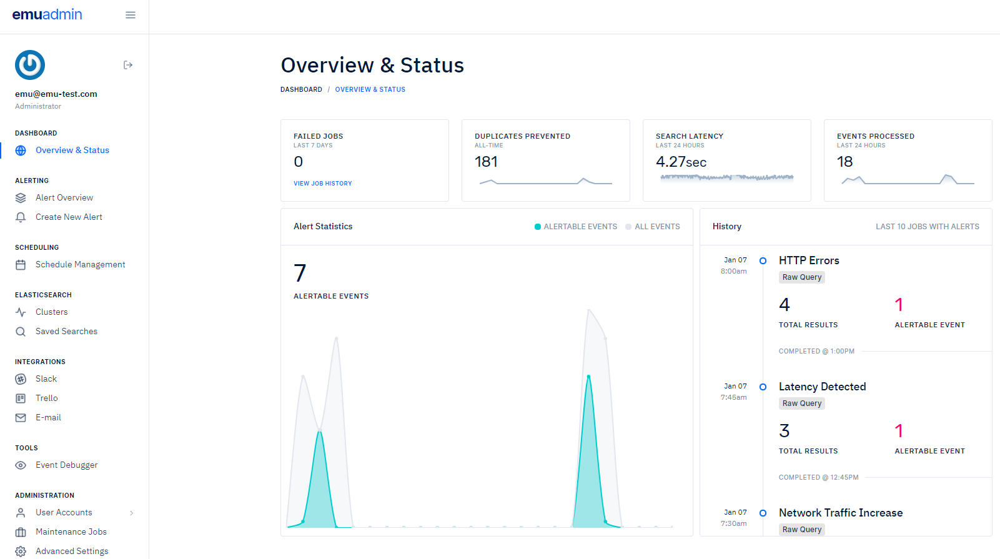
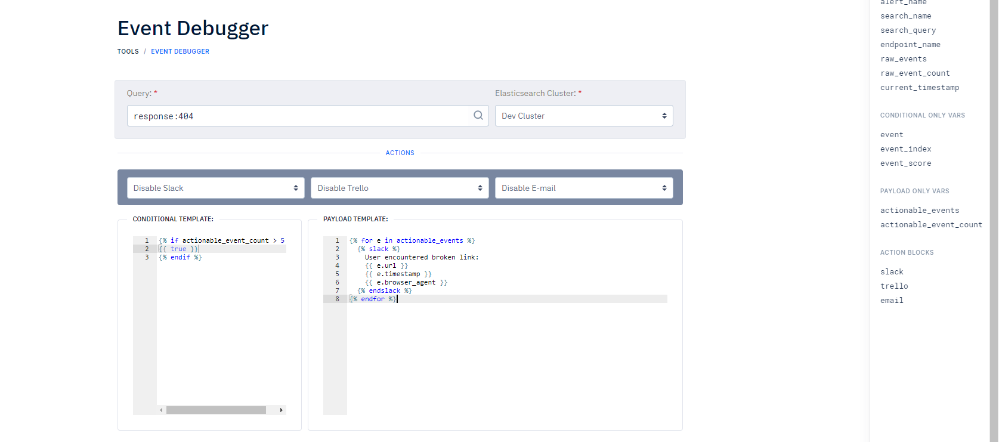
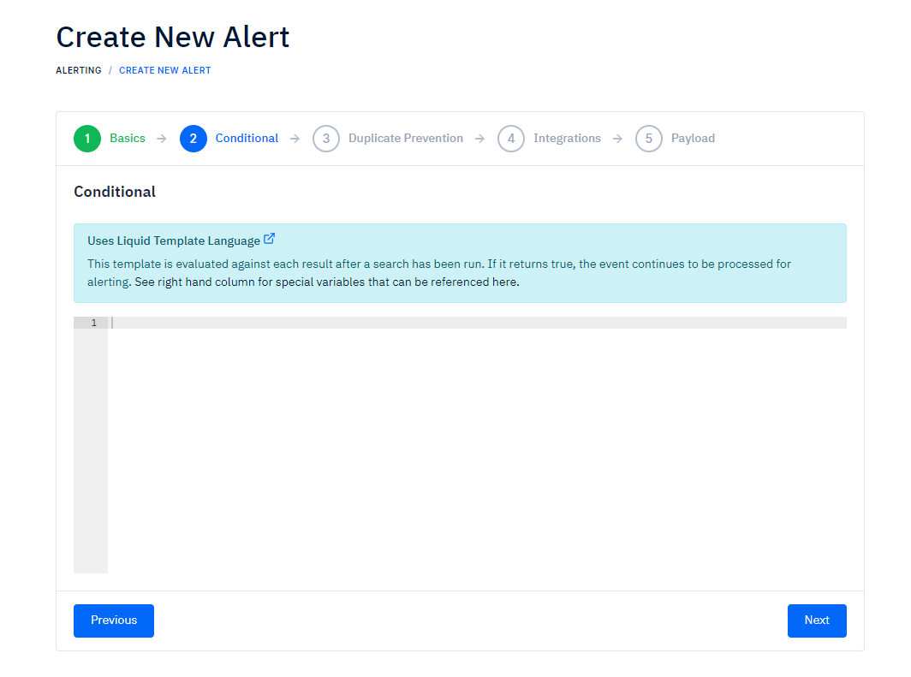
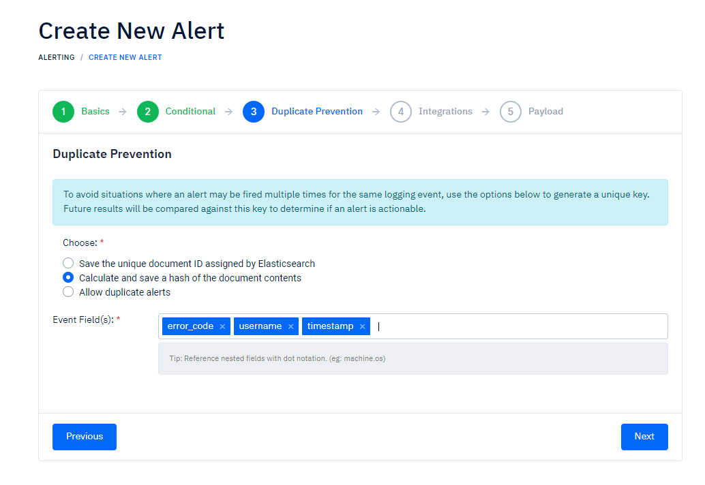

# EMU - Elastic Management UI

EMU is a tool for teams who need to programmatically generate *unique* alerts for events stored in Elasticsearch.

## Why not X-Pack's Watcher?

### Difficult to prevent duplicate alerts
In a perfect scenario, all logging events would be indexed at the time they were generated.

Unfortunately, logs can experience delays from the time they are generated to the time they are indexed. Often times, a backlog of events may be queued waiting to be parsed and processed. If a team stores log data using the log's own timestamp, alerting on these delayed events poses an interesting challenge. 

* Option #1: Configure Watcher to search the last X hours every Y minutes. 
  * **Pro**: Should alert on any events that have a timestamp between `now` and `now-Xh`
  * **Con**: Likely that duplicate alerts will be generated. 

* Option #2: Search the last X minutes, every X minutes.
  * **Pro**: Alerts are not duplicated, 
  * **Con**: May miss events whose timestamp is older than `now-Xm`.

### Painless is ... painful?
Elasticsearch's scripting language "Painless" leaves a lot to be desired when it comes to documentation and example usage. EMU instead leverages [Shopify's Liquid](https://shopify.github.io/liquid/basics/introduction/) language, which many may find similiar to [Jinja2](https://jinja.palletsprojects.com/en/2.10.x/).

### User experience
JSON certainly isn't rocket science, but it can get messy quick, especially with complex searches and multiple actions. We think a better approach is to use a [step-by-step wizard](docs/wizard-1.PNG) to walk users through the creation of mission-critical alerts.

### Third-party integrations
EMU currently supports 3 types of notification options: slack messaging, Trello card (and list!) creation, as well as e-mail. [Additional integrations can be easily added](https://github.com/Shopify/liquid/wiki/Liquid-for-Programmers#create-your-own-tag-blocks) thanks to the Liquid template language.

## Screenshots
#### Dashboard & Stats

#### Testing and debugging alerts

#### Step-by-step wizard 

#### Multiple options to prevent duplicate alerts

## Installation guide
[Click here](INSTALL.md) to get started.

